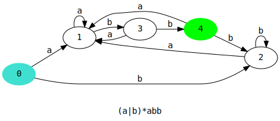

# rtd

Tool for generating a DFA for a given regular expression. It can either print
the DFA's 5-tuple components, or output the DFA as a
[DOT](https://en.wikipedia.org/wiki/DOT_(graph_description_language)) file.

Steps:

* Convert the input regex from infix to postfix notation (with the shunting
  yard algorithm);
* Convert the regex to a λ-NFA using Thompson's construction algorithm;
* Convert the λ-NFA to a DFA using the powerset construction algorithm.

## Operators

* `<s1>|<s2>` - Matches either the subexpression `<s1>` or `<s2>`;
* `<s1><s2>` - Matches the subexpression `<s1>` concatenated with `<s2>`;
* `<s>*` - Matches zero or more occurrences of `<s>`;
* `<s>+` - Matches one or more occurrences of `<s>`;
* `<s>?` - Matches zero or one occurance of `<s>`.

## Building

### Dependencies:

* C++20 compatible compiler;
* `make`;
* [`graphviz`](https://graphviz.org/docs/library/);
* `pkg-config`.

On Debian-based systems, they can usually be installed as follows:

```bash
$ sudo apt install g++ make pkg-config libgraphviz-dev
```

To clone and build the program, run:

```bash
$ git clone https://github.com/niculaionut/rtd.git
$ cd rtd
$ make
```

### Examples:

#### Commands:

```
$ ./rtd -h
USAGE:
    rtd [FLAGS/OPTIONS] <regex>

FLAGS:
    -h
        Print help info.
    -a
        Set the alphabet of the regex as all alphanumericals.
    -e
        Export the graph in DOT language (by default, only the DFA components will be printed).

OPTIONS:
    -s <alphabet>
        Set the alphabet of the regex (only alphanumericals allowed).
    -o <output_file>
        Set the path at which the graph file will be written (default is stdout).
```

```bash
$ ./rtd -e '(a|b)*abb' >graph.dot
$ dot -Tsvg graph.dot >graph.svg
$ firefox graph.svg
```

#### Results:

```
STATES = {q0, q1, q2, q3, q4}
SIGMA = {a, b}
TRANSITIONS:
        δ(q0, a) = q1
        δ(q0, b) = q2
        δ(q1, a) = q1
        δ(q1, b) = q3
        δ(q2, a) = q1
        δ(q2, b) = q2
        δ(q3, a) = q1
        δ(q3, b) = q4
        δ(q4, a) = q1
        δ(q4, b) = q2
START STATE = q0
FINAL STATES = {q4}
```



## Resources

* ['Shunting yard' algorithm](https://www.engr.mun.ca/~theo/Misc/exp_parsing.htm);
* [Thompson's construction algorithm](https://en.wikipedia.org/wiki/Thompson%27s_construction);
* [Powerset construction algorithm](https://en.wikipedia.org/wiki/Powerset_construction);
* [`graphviz` example](https://gitlab.com/graphviz/graphviz/-/blob/main/dot.demo/example.c).
